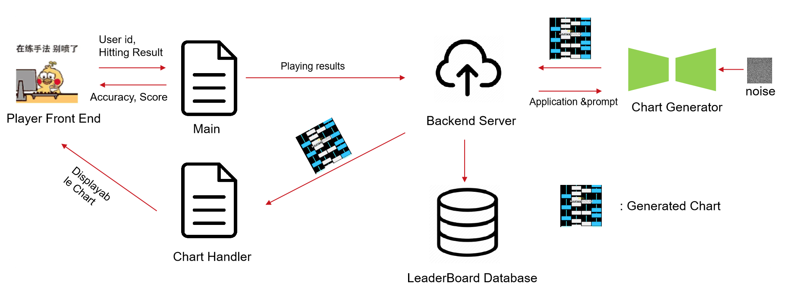

# Team Roster
林方晴,Lin Fangqing,520021911352,l_kathryn@sjtu.edu.cn 
Responsible for: backend database storage, several apis for the frontend to call, for example: return leaderboard, return world rank, login, signup. And access token in order to prevent server attacking. Assisted in deploying the diffusion model on Linux. Tested the backend functionality and integrated it with the frontend.

魏林达,Wei Linda,520370910056,lullcant@sjtu.edu.cn 
Responsible for: Backend AI generative model settlement, osu to our game chart parser, game lag optimization. Almost all frontend UI Pannels and UI codes includes:
UI: Title page, User Profile Panel, Selection Pannel, Setting Pannel, World rank pannel, Frontend login pannel, In game-link to diffusion backend. 
Code: Backend: Diffusion webui code, DPM 1st order Sampler,
      Frontend: Scriptable object and Update function and logic for user profile, Update function and communicate with backend for world rank leaderboard, the appear and disappear logic for login pannel, Conrtrolling code for the slider UI of game audio and game speed, link to diffusion backend. 
      upload score to the backend server in game manager.

王韵晨,Wang Yunchen,520370910012,mac-wang@sjtu.edu.cn
Responsible for: Resolved a variety of challenges associated with deploying the project across different platforms, particularly focusing on issues like reading from external storage, rendering inconsistencies, and display anomalies on Android devices. Notably, corrected the display issues caused by UnityWebRequest specifically on Android. Additionally, took charge of developing the bulk of the code required for Android gyroscope detection, a pivotal functionality within the project. Assisted in testing the overall performance of the entire project, managed the majority of migration releases in the Git repository, and handled pull requests.

张婧妍,Zhang Jingyan,520370910005,menako2013529@sjtu.edu.cn 
Responsible for: Preliminary investigation, UI interface aesthetic design. Main writer for the TC part including the graduation thesis.

张天成,Zhang Tiancheng,520370910058,1054981050@sjtu.edu.cn  
Responsible for: Adjust the Andrioid controller and design logic to choose a chart in selection pannel.

杨玥,Yang Yue,520370910061,yue.yang@sjtu.edu.cn 
Responsible for: front end login and registration interface and communication with the backend; front end design of some gyroscope functions, including spectrum generation of rotation buttons and front-end display; assist in resolving latency issues.

## Challenges encountered
Our rhythm game experienced no lag when emulated in Unity, but after downloading the APK to the mobile device, there was significant latency, stuttering, and frame drops. Eventually, by reducing the refresh rate in various areas, minimizing unnecessary UI updates, and increasing the allocated memory, we were able to improve the game's smoothness. 
We encountered an issue where UnityWebRequest was unable to read files from the persistent data directory. This problem was resolved by replacing UnityWebRequest with alternative methods. Additionally, regarding the loading of songs, the original project on Windows could directly access a directory, but this functionality was not possible after packaging into an APK. Therefore, we switched to using the StreamingAssets path to facilitate reading on Android devices

# Getting Started
##   Chart Diffuser
Diffusion model for generating the chart for play. To build the model locally, please fullfill the following requirements.
1. [Install Python (here it is Python 3.9) ](https://www.python.org/downloads/), or [Install anaconda3](https://www.anaconda.com/download)
2. Open Anaconda Prompt, install all the denpendencies
```
conda create -n helix python=3.9 \n
conda activate helix  \n
git clone (link to this repo)  
cd chart_diff \n
pip install -r requirements.txt
```
### To run the diffusion generative model
```
python webui.py
```
For continuous running, we suggest use a tmux environment.
### Installation for tmux (on ubuntu platform)
```
sudo apt-get install tmux
```
### Create and enter tmux session to run the model
```
tmux new -s mug \
conda activate helix \
python webui.py
```
### Enter the session after exit(ctrl+d)
```
tmux attach -t mug
```
In the tmux sessions, ctrl+b+[ for viewing the output inforamtion.


## Backend Server
To set up the backend API on the server, I first deployed the Python-based API using Gunicorn. The command gunicorn --workers 3 myapp:app was executed inside a tmux session to ensure that the process remains running even after disconnecting from the terminal. This setup allowed the API to listen on localhost:8000.

Next, I configured Nginx as a reverse proxy to forward incoming requests on port 80 to the API running on port 8000. Below is the relevant portion of the Nginx configuration:

nginx
Copy code
server {
    listen 80;
    server_name example.com;

    location / {
        proxy_pass http://127.0.0.1:8000;
        proxy_set_header Host $host;
        proxy_set_header X-Real-IP $remote_addr;
        proxy_set_header X-Forwarded-For $proxy_add_x_forwarded_for;
        proxy_set_header X-Forwarded-Proto $scheme;
    }
}
To secure the connection with HTTPS, I utilized Certbot to obtain an SSL certificate. After installation, the Nginx configuration was updated to include SSL settings:

nginx
Copy code
server {
    listen 80;
    server_name example.com;
    return 301 https://$host$request_uri;
}

server {
    listen 443 ssl;
    server_name example.com;

    ssl_certificate /etc/letsencrypt/live/example.com/fullchain.pem;
    ssl_certificate_key /etc/letsencrypt/live/example.com/privkey.pem;

    location / {
        proxy_pass http://127.0.0.1:8000;
        proxy_set_header Host $host;
        proxy_set_header X-Real-IP $remote_addr;
        proxy_set_header X-Forwarded-For $proxy_add_x_forwarded_for;
        proxy_set_header X-Forwarded-Proto $scheme;
    }
}
This configuration ensures that all HTTP traffic is redirected to HTTPS, providing a secure connection for users accessing the API.
## Main Game Programme
The main game programme is implemented on Unity. [Unity](https://unity.com/cn)
Our project is based on GitHub user *LHEALP*'s UnityRhythmGame2: [https://github.com/LHEALP/UnityRhythmGame](https://github.com/LHEALP/UnityRhythmGame)

### How to bootstrap our project

First, you would need a working copy of Unity Engine. Unity Engine's commercial model is subscription-based: individual users may apply for a personal license at no-cost for studying purposes.

- Go to [www.unity.com](www.unity.com) to register for a Unity account and download **Unity Hub** to your computer.


After setting up and starting Unity Hub, it would prompt you to install a copy of Unity Engine to your computer. **Please select** **Unity *2022.3*.*\** LTS** **at this step**. Our project is built with Unity 2022.3.36f1 LTS, and any version significantly older or newer (***don't use Unity 6 Preview***) may render the project not buildable. 


During installation, you would need to select ***Android build support, OpenJDK, Android SDK & NDK tools*** with your installation. Unity does NOT support custom JDK and Android SDKs.


Now you can `git clone` to clone our repository. In Unity Hub, import project from `Projects -> Add -> Add project from disk`, and select `$GIT_CLONE_ROOT/frontend`. Unity would automatically install all plugins it need for you, so you won't need to worry about importing 3rd-party plugins.


Finally in **Unity Editor**:

- On the upper-left panel `File`, select `Build Settings` and switch the platform to Android. 


Now you may build our project and obtain a working APK bundle!

# Model and Engine
## The Story Map

## The model engine 

1. The player front end and the main programme will be implemented by Unity
2. The backend server and database will be implemented by flask and mySQL
3. The chart generator is a trained latent diffusion model (LDM)
4. The chart handler is a simple parser written in C#
## API Endpoints

### 1. Register User

**Endpoint:** `/api/register`  
**Method:** `POST`  
**Description:** Registers a new user with a username and password.

**Request:**

```json
{
  "username": "your_username",
  "password": "your_password"
}
```

**Response:**

- Success: `201 Created`
  ```json
  {
    "message": "User registered successfully"
  }
  ```
- Error: `401 Unauthorized` if the username already exists.
  ```json
  {
    "message": "Invalid username"
  }
  ```

### 2. Login User

**Endpoint:** `/api/login`  
**Method:** `POST`  
**Description:** Logs in a user with a username and password.

**Request:**

```json
{
  "username": "your_username",
  "password": "your_password"
}
```

**Response:**

- Success: `200 OK`
  ```json
  {
    "message": "Login successful"
  }
  ```
- Error: `401 Unauthorized` if the credentials are invalid.
  ```json
  {
    "message": "Invalid credentials"
  }
  ```

### 3. Submit Score

**Endpoint:** `/api/score`  
**Method:** `POST`  
**Description:** Submits or updates the score for a user. (The world rank is recalculated after submission.)

**Request:**

```json
{
  "username": "your_username",
  "score": 1500
}
```

**Response:**

- Success: `200 OK`
  ```json
  {
    "message": "Score submitted successfully"
  }
  ```

### 4. Get World Rank

**Endpoint:** `/api/rank`  
**Method:** `GET`  
**Description:** Retrieves the world rank for a specific user.

**Request:**

```http
GET /api/rank?username=your_username
```

**Response:**

- Success: `200 OK`
  ```json
  {
    "username": "your_username",
    "world_rank": 1
  }
  ```
- Error: `404 Not Found` if the user is not found.
  ```json
  {
    "message": "User not found"
  }
  ```

### 5. Delete User

**Endpoint:** `/api/delete`  
**Method:** `POST`  
**Description:** Deletes a user based on their ID.

**Request:**

```json
{
  "id": 1
}
```

**Response:**

- Success: `200 OK`
  ```json
  {
    "message": "User deletion successfully"
  }
  ```
- Error: `401 Unauthorized` if the user is not found.
  ```json
  {
    "message": "User not found"
  }
  ```


### 6. Leaderboard

**Endpoint:** `/api/leaderboard`  
**Method:** `GET`  
**Description:** Retrieves the top five scores along with usernames and world ranks.

**Request:** None needed. Simply make a GET request to the endpoint.

**Response:**

- Success: `200 OK`
  ```json
  [
      {
          "username": "player1",
          "score": 1200,
          "world_rank": 1
      },
      {
          "username": "player2",
          "score": 1150,
          "world_rank": 2
      },
      {
          "username": "player3",
          "score": 1100,
          "world_rank": 3
      },
      {
          "username": "player4",
          "score": 1050,
          "world_rank": 4
      },
      {
          "username": "player5",
          "score": 1000,
          "world_rank": 5
      }
  ]
  ```


## Example Usage with `curl`

### Register a User

```sh
curl -X POST http://localhost:5000/api/register -H "Content-Type: application/json" -d '{
  "username": "testuser",
  "password": "testpassword"
}'
```

### Login a User

```sh
curl -X POST http://localhost:5000/api/login -H "Content-Type: application/json" -d '{
  "username": "testuser",
  "password": "testpassword"
}'
```

### Submit a Score

```sh
curl -X POST http://localhost:5000/api/score -H "Content-Type: application/json" -d '{
  "username": "testuser",
  "score": 1500
}'
```

### Get World Rank

```sh
curl -X GET "http://localhost:5000/api/rank?username=testuser"
```

### Delete a User

```sh
curl -X POST http://localhost:5000/api/delete -H "Content-Type: application/json" -d '{
  "id": 1
}'
```

### Get Leaderboard

```sh
curl -X GET http://localhost:5000/api/leaderboard
```

## Third-Party SDKs
https://github.com/Keytoyze/Mug-Diffusion
# View UI/UX
The complete UI/UX mockups are shown below. We use Figma to 
create a digital prototype. The entire music game includes: a start interface, a song selection interface, a play interface, a pause and settlement interface, as well as a customized interface for players to upload audio and generate music scores.

## Usability Testing


Based on the following questions, we construct our usability test.

1. How easily can a user open the setting interface for adjusting the scroll speed or brightness?
2. How easily can a user switch to the chart he wants to play?
3. How easily can a user upload the music and obtain the corresponding chart generated by the diffusion model?
4. How easily can a user know how to play the game (e.g., how to hit the rice and long notes, how to get 'perfect' in the judgement)?
5. How easily can a user know the score of the chart he just played and check the leaderboard of the chart?

A total of 6 testers participated and each completed the following tasks:

1. Find out how to adjust the scroll speed to fit yourself and find out how to adjust the brightness.
2. Choose a sound with difficulty 4 stars and start playing the sound.
3. Open the chart generation interface and upload an mp3/mp4 file and try to generate a map with 4 stars.
4. Randomly start a game and get 5 perfect judgements.
5. After playing a game, check your accuracy and score. Check your ranking of the song.

After testing, the evaluation was statistically summarized, and the following conclusions were drawn.

- **Navigation and Accessibility**: The rightmost button on the main interface was not evidently clickable, leading to confusion about their functionality. Therefore, the music upload and custom map generation feature was completely overlooked by testers, indicating a lack of discoverability.
- **Gameplay Understanding**: Testers struggled to understand the mechanics of starting the game on the song-selection interface, suggesting that the in-game hints are not sufficient. Also, testers didn’t find it can be paused/restarted in the in-game interface.

## Final UI/UX Design

Based on the feedback received, in the final UI/UX design, we have implemented significant enhancements to two main interface buttons to address visibility and interaction issues identified during testing.

1. The main interface buttons have undergone significant improvements to address visibility and interaction issues identified during testing. The previous design did not describe or depict any user interaction for the music upload button. To improve this, the button has been redesigned with prominent black borders and shadow effects, making it stand out as a clickable element. This change aims to improve the visibility and discoverability of music upload functionality. During the testing process, this button was completely ignored, and qualitative feedback indicated that the user did not notice it. By making the button visually clearer, it ensures that users can easily find and interact with it.
2. The old design of the game start button was uniform and lacked uniqueness. To address this issue, we have enhanced the play button with brighter colors and added shadow effects to improve its visibility and clickability. This redesign makes navigation more intuitive, as demonstrated by quantitative research results, which previously prevented users from effectively launching the game. The new design ensures that users can easily recognize and interact with the play button, thereby improving their overall experience.


